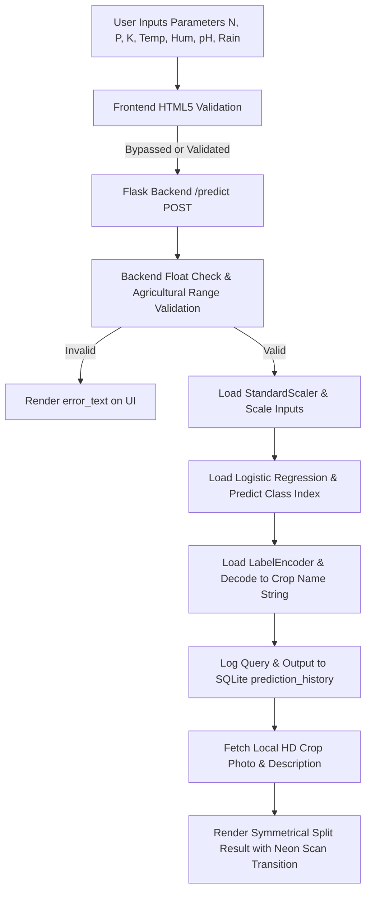
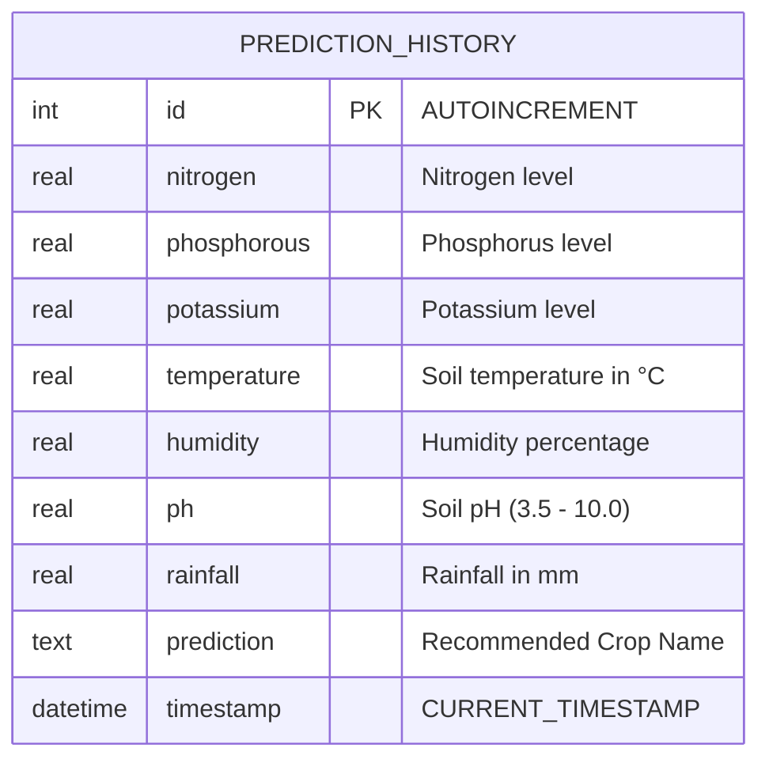

# OptiCrop: Smart Agricultural Production Optimization Engine

OptiCrop is an AI-powered crop recommendation system that leverages Machine Learning (Logistic Regression) and soil chemical profiles to predict the most suitable crop for cultivation. It features a modern, interactive, glassmorphic dark mode user interface with real-time parameter configuration, built-in SQLite history logging, and dynamic predicted crop illustrations.

---

## 📁 Project Structure

```text
intelligent-nobel/
├── app.py                     # Main Flask web application server
├── train_logistic_model.py    # Dataset downloader and Logistic Regression trainer
├── Crop_recommendation.csv    # Crop recommendation dataset (2,200 records)
├── best_crop_model.pkl        # Serialized Logistic Regression model
├── scaler.pkl                 # Serialized StandardScaler pipeline
├── label_encoder.pkl          # Serialized LabelEncoder pipeline
├── opticrop.db                # SQLite database logging predictions (auto-generated)
├── vercel.json                # Vercel deployment routing mapping config
├── requirements.txt           # Python environment dependency specifications
└── static/
    ├── css/
    │   └── style.css          # Unified CSS styling with custom animations
    └── images/                # HD generated UI background assets
```

---

## 🔄 System Flow Diagram

Below is the execution flow of the crop recommendation engine from user input to ML output:



---

## 🗄️ Database Entity Relationship (ER) Diagram

The system records recommendations in a local SQLite database for history tracking:



---

## 🛠️ Pre-requisites & Local Installation

Ensure you have Python 3.10 or higher installed. Run the following command at the project root to install the required dependencies:

```bash
pip install flask numpy pandas scikit-learn requests
```

### 1. Train the Machine Learning Model
Before launching the server, train the Logistic Regression model on the dataset. The script will automatically download the official dataset and fit the StandardScaler and LabelEncoder:

```bash
python train_logistic_model.py
```
This output-serializes three pickle files (`best_crop_model.pkl`, `scaler.pkl`, and `label_encoder.pkl`) directly into the project directory.

### 2. Run the Web Application
Launch the Flask development server:

```bash
python app.py
```

Open your browser and navigate to **`http://127.0.0.1:5000`** to interact with the application.
